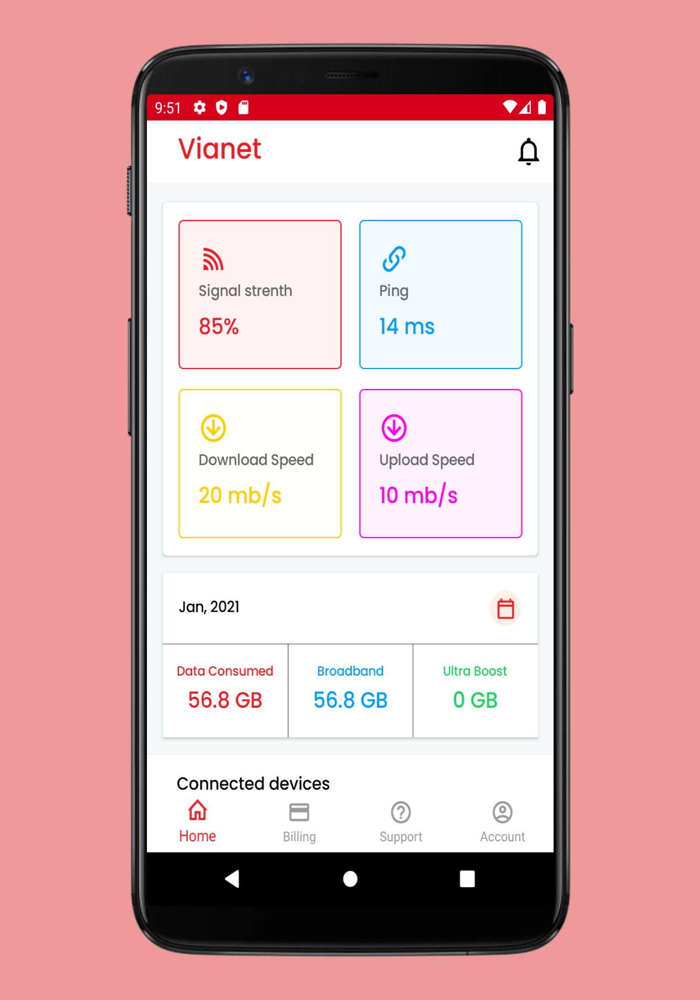

# ISP Mobile App design (Work in progress)

## Developed using 
Xamarin Forms 5.0 
Learn More: https://docs.microsoft.com/en-us/xamarin/xamarin-forms/

## Features
* ColletionView
* TabbedPage
* Font Icon
* Shell

## Generate C# code from icon font
Link: https://andreinitescu.github.io/IconFont2Code/

## Chart
Chart is displayed in webview with chart.js
Learn More: https://www.chartjs.org/docs/latest/charts/doughnut.html
Blog : https://blog.dangl.me/archive/building-hacky-but-free-graphs-and-charts-in-xamarinforms-with-chartjs/

## Available Platforms
* Android
* Ios

## Preview
    
    
   

